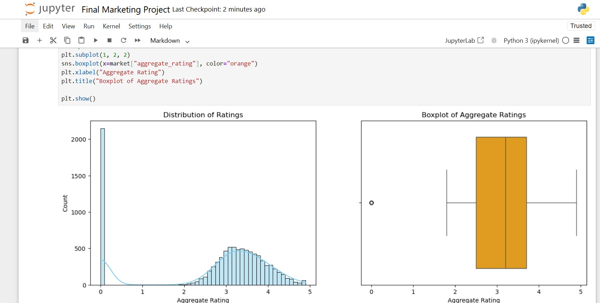

# 🍽️ Marketing Project – Restaurant Data Analysis
Data analysis project for identifying restaurant trends and insights using visual exploration.

## 📌 Project Overview
- This project focuses on analyzing restaurant data to help a **restaurant consolidator** revamp its B2C platform using intelligent automation techniques.  
- The main objective is to explore restaurant trends, understand customer preferences, and identify high-performing restaurants through data analysis and visualization.

---

## 🎯 Problem Statement
A restaurant aggregator is seeking to enhance its consumer-facing platform.  
It aims to:
- Recommend top restaurants,
- Understand market coverage,
- Identify key performance metrics across various cities.

To achieve this, the dataset needs to be explored to extract meaningful insights before building any intelligent recommendation model.

---

## 🛠️ Tools Used
- **Python (Pandas, Matplotlib, Seaborn)** – for data preprocessing and EDA
- **Tableau** – for dashboarding and interactive data exploration

---

## 🔍 Approach & Analysis

### 1. 📋 Data Import & Cleaning

#### Importing necessary libraries and loading dataset

#### Understanding data structure, cleaning variable names, and handling missing values

#### Part of handling missing values

---

### 2. 📊 Exploratory Data Analysis (EDA)

#### Distribution of Ratings  
Histogram with KDE and boxplot to understand the spread of ratings.

#### Relationship between Aggregate Ratings and Number of Cuisines  
Boxplot showing how the number of cuisines influences ratings.

#### Ratio of Booking vs Non-Booking Restaurants  
Pie chart comparing restaurants that allow table booking vs those that don’t.

---

### 3. 📈 Dashboarding

An interactive **Tableau Dashboard** was created to:
- Filter and explore restaurants by city, rating, booking, and cuisine.
- Identify high-performing restaurants.
- View cost and delivery options.

---

## 🧠 Key Insights
- Some cities dominate the restaurant scene while others are underrepresented.
- Ratings tend to be higher for restaurants offering more cuisine variety.
- Restaurants that allow table booking and delivery options tend to have better customer engagement.
- Cost, number of cuisines, and service options influence ratings.

---

## ✅ Conclusion
This analysis provides valuable insights into restaurant trends, customer preferences, and key performance metrics.  
It lays the groundwork for building a **data-driven recommendation system** for the restaurant aggregator.

---

> 📌 **Note:** Dataset and source code are not included to maintain project originality and intellectual ownership.
